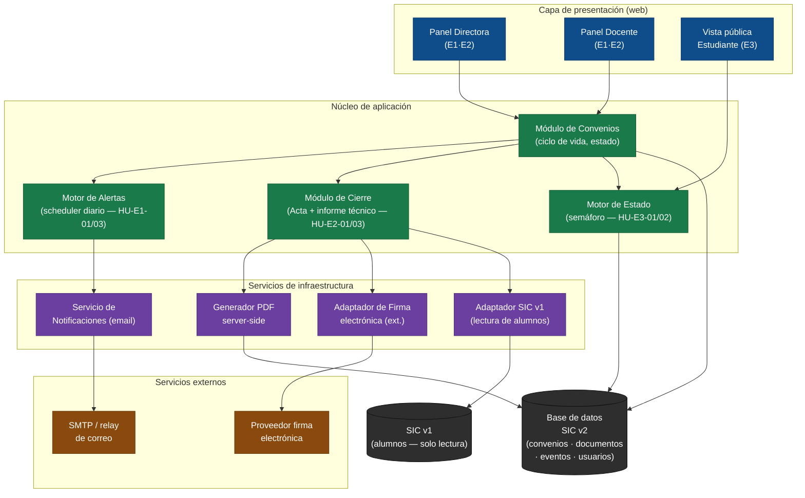

# Arquitectura — SIC v2 (Sistema de Información de Convenios)

> Architect · 2026-06-20
> Fuente: `deliveries/cic/inbox/` · `deliveries/cic/outputs/backlog.json`

---

## Principio rector

> Lo más simple que sostenga el valor. El SIC v1 fue construido en cascada y
> cualquier ajuste exige una nueva versión completa (`Fundador.md`, R-11). La
> arquitectura del v2 responde a ese aprendizaje: módulos cohesivos con
> responsabilidades claras, acoplados solo donde el dominio lo exige.

---

## Diagrama de componentes

---

## Decisiones tomadas (ver ADRs)

| ADR | Decisión | Épica/Fuerza |
|-----|----------|--------------|
| ADR-0001 | Monolito modular, no microservicios | R-11, todo el MVP |
| ADR-0002 | Scheduler diario tipo cron para alertas | E1 — HU-E1-01/03 |
| ADR-0003 | Generación de PDF server-side | E2 — HU-E2-01 |
| ADR-0004 | Adaptador de lectura al SIC v1 (no migración) | E2 — HU-E2-03, OQ-03 |
| ADR-0005 | Firma electrónica vía proveedor externo (decisión de proveedor diferida) | E2 — HU-E2-02, OQ-01/02 |

---

## Decisiones explícitamente diferidas (open questions de arquitectura)

| Tema | Por qué no se decide ahora |
|------|---------------------------|
| Proveedor concreto de firma electrónica | OQ-01 (validez legal ante la contraloría) y OQ-02 (capacidad de contrapartes externas) no están resueltas. Decidir el proveedor sin saber si la contraloría acepta firma digital es trabajo que se haría dos veces. |
| Migración de datos del SIC v1 | OQ-03 (completitud de registros de alumnos) no está validada. El adaptador de lectura cubre el MVP; la migración completa requiere auditoría de datos previa. |
| Autenticación y roles (SSO vs. cuentas locales) | El discovery no tocó este aspecto. Es una open_question para el equipo antes del sprint de E2. |
| Stack tecnológico concreto (framework, lenguaje) | Fuera del alcance del delivery ágil; lo decide el equipo de desarrollo al inicio del sprint. El MVP no impone restricción técnica más allá de R-11 (modularidad) y R-12 (integridad de estado). |
