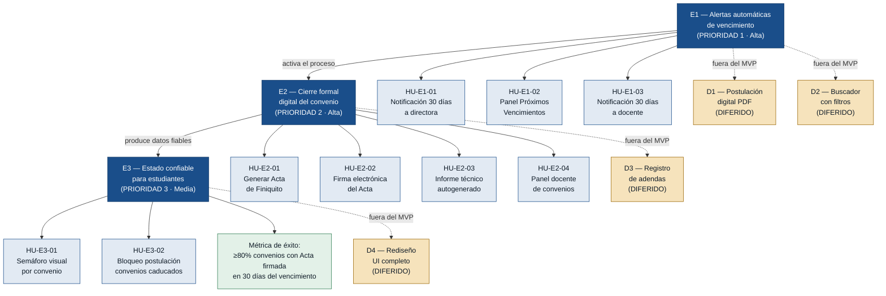

# Épicas — SIC v2 (Sistema de Información de Convenios)

> Product Owner · 2026-06-20
> Fuente: `deliveries/cic/inbox/`

---

## Resumen de valor

El SIC v2 cierra el ciclo de vida del convenio académico que el v1 dejó incompleto:
aproximadamente el 20 % de los convenios ya caducaron sin Acta de Finiquito firmada,
generando riesgo legal ante la contraloría. El MVP ataca ese riesgo en tres pasos:
primero, alerta antes de que el problema ocurra; segundo, digitaliza el acto formal
de cierre; tercero, garantiza que lo que el estudiante ve en pantalla refleje la realidad.

---

## Épica 1 — Alertas automáticas de vencimiento

**Valor:** La Directora de Alianzas y los docentes responsables reciben aviso 30 días
antes del vencimiento, eliminando el patrón de "expiración silenciosa" que es la
causa raíz del ~20 % de convenios caducados sin cierre.

**Origen en MVP Canvas:** Funcionalidad mínima 1 — Motor de alertas automáticas.
Cadena de valor: Output → Outcome (convenios se cierran antes de que expiren de facto).

**Requisitos trazados:** R-01, R-03

**User Stories origen:** US-01

**Prioridad:** Alta

**Justificación de prioridad:** Es el desencadenante de todo el ciclo de cierre. Sin
alerta, el docente nunca inicia el proceso de Acta de Finiquito a tiempo; es el riesgo
más probable y el de mayor impacto legal inmediato según `Fundador.md`.

### Historias candidatas (sin refinar — solo para contexto)

- **[HU-E1-01]** Como fundadora / directora de alianzas, quiero recibir una
  notificación automática 30 días antes del vencimiento de cada convenio, para
  activar el proceso de cierre antes de que el convenio caduque de facto.
  *(Origin: US-01, R-01)*

- **[HU-E1-02]** Como fundadora / directora de alianzas, quiero ver en mi panel una
  sección "Próximos vencimientos" ordenada por urgencia, para conocer de un vistazo
  cuáles convenios requieren atención inmediata.
  *(Origin: US-01, R-03)*

- **[HU-E1-03]** Como profesor gestor de convenios, quiero recibir la misma alerta
  de vencimiento que la directora para poder preparar el informe técnico de cierre
  con anticipación suficiente.
  *(Origin: US-01, R-01)*

---

## Épica 2 — Cierre formal digital del convenio

**Valor:** La Directora y los docentes completan el cierre de un convenio vencido
íntegramente dentro del sistema — con Acta de Finiquito prellenada, informe técnico
autogenerado y firma electrónica — sin redactar en Word ni perseguir firmas físicas.
Este es el outcome central del MVP: convenios que antes cerraban "de palabra" ahora
dejan evidencia digital ante la contraloría.

**Origen en MVP Canvas:** Funcionalidades mínimas 2, 3 y 4 — Módulo de cierre
digital, generación del informe técnico, panel del docente.

**Requisitos trazados:** R-02, R-04, R-05

**User Stories origen:** US-02, US-03, US-04

**Prioridad:** Alta

**Justificación de prioridad:** Resuelve el riesgo legal central documentado en
`Fundador.md` y `Profesor.md`; sin este módulo el MVP no logra su métrica de éxito
(≥ 80 % de convenios con Acta firmada dentro de los 30 días del vencimiento).
Se prioriza segunda porque depende de que la Épica 1 active el proceso.

### Historias candidatas (sin refinar — solo para contexto)

- **[HU-E2-01]** Como fundadora / directora de alianzas, quiero que el sistema genere
  automáticamente el Acta de Finiquito prellenada con los datos del convenio, para
  eliminar la redacción manual y dejar evidencia digital del cierre.
  *(Origin: US-02, R-02)*

- **[HU-E2-02]** Como fundadora / directora de alianzas, quiero que todas las partes
  puedan firmar el Acta de Finiquito electrónicamente dentro del sistema, para que el
  convenio quede cerrado formalmente sin requerir documentos físicos.
  *(Origin: US-02, R-02)*

- **[HU-E2-03]** Como profesor gestor de convenios, quiero que el sistema extraiga
  automáticamente los datos de los alumnos participantes y genere el borrador del
  informe técnico de cierre, para no redactarlo desde cero en Word.
  *(Origin: US-03, R-04)*

- **[HU-E2-04]** Como profesor gestor de convenios, quiero un panel que liste
  únicamente los convenios bajo mi responsabilidad con su estado actual y acceso
  directo al flujo de cierre, para no depender de búsquedas manuales en toda la base.
  *(Origin: US-04, R-05)*

---

## Épica 3 — Estado confiable de convenios para estudiantes

**Valor:** El estudiante que consulta el SIC ve el estado real de cada convenio
(semáforo verde/ámbar/rojo) y no pierde tiempo ni dinero postulando a alianzas
que ya caducaron. Esto convierte los datos de cierre de las épicas 1 y 2 en
información útil para el usuario final.

**Origen en MVP Canvas:** Funcionalidad mínima 5 — Indicador de estado en tiempo real.
Requisito no funcional R-12 (integridad de datos / confiabilidad).

**Requisitos trazados:** R-07, R-08, R-12

**User Stories origen:** US-05

**Prioridad:** Media

**Justificación de prioridad:** Depende de que las épicas 1 y 2 produzcan datos de
estado fiables; sin ellas el semáforo no tiene información correcta que mostrar. Es
la tercera prioridad porque su valor llega cuando el ciclo de cierre ya funciona,
aunque el dolor del estudiante (`alumno.md`: datos desactualizados) es real y documentado.

### Historias candidatas (sin refinar — solo para contexto)

- **[HU-E3-01]** Como estudiante, quiero ver un indicador tipo semáforo (verde, ámbar,
  rojo) en el listado de convenios, para identificar de un vistazo cuáles están activos
  con cupos disponibles sin revisar cada registro.
  *(Origin: US-05, R-08)*

- **[HU-E3-02]** Como estudiante, quiero que el sistema bloquee mis postulaciones a
  convenios marcados como "Caducado" (rojo), para no invertir tiempo en gestiones que
  el propio sistema ya sabe que son inválidas.
  *(Origin: US-05, R-07)*

---

## Épicas diferidas (fuera del MVP)

Las siguientes historias emergen de la evidencia del discovery pero no entran al MVP
porque no atacan el núcleo de valor identificado y están explícitamente fuera de
alcance en el MVP Canvas.

| ID | Título | Razón de diferimiento | Origin |
|----|--------|-----------------------|--------|
| D1 | Postulación digital con CV en PDF | Dolor real del estudiante pero no genera riesgo legal; el estado confiable resuelve el dolor más agudo primero. Fuera de alcance en MVP Canvas. | US-06-DIFERIDA |
| D2 | Buscador con filtros por carrera | El semáforo resuelve el problema de datos falsos; el filtro mejora usabilidad pero no es el dolor más urgente. Fuera de alcance en MVP Canvas. | US-07-DIFERIDA |
| D3 | Registro de adendas sin perder historial | Dolor documentado del profesor (R-06), pero el flujo de cierre es la prioridad de la dirección. Fuera de alcance en MVP Canvas. | US-08-DIFERIDA |
| D4 | Rediseño completo de la interfaz de usuario | Mencionado en `alumno.md` (interfaz no amigable), pero diferido explícitamente en MVP Canvas; la UX puede mejorar en paralelo sin bloquear el núcleo. | personas.md (Estudiante E.) |

---

## Diagrama del backlog

